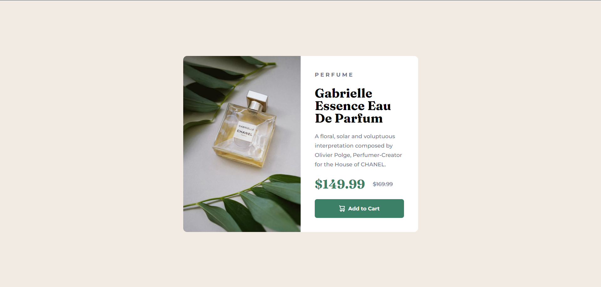
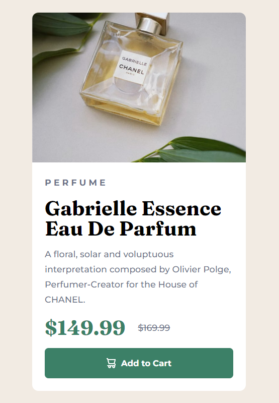

# Frontend Mentor - Product preview card component solution

This is a solution to the [Product preview card component challenge on Frontend Mentor](https://www.frontendmentor.io/challenges/product-preview-card-component-GO7UmttRfa). Frontend Mentor challenges help you improve your coding skills by building realistic projects. 

## Table of contents

- [Overview](#overview)
  - [The challenge](#the-challenge)
  - [Screenshot](#screenshot)
  - [Links](#links)
- [My process](#my-process)
  - [Built with](#built-with)
  - [What I learned](#what-i-learned)
  - [Continued development](#continued-development)
  - [Useful resources](#useful-resources)
- [Author](#author)

## Overview

### The challenge

Users should be able to:

- View the optimal layout depending on their device's screen size
- See hover and focus states for interactive elements

### Screenshot




### Links

- Solution URL: [Repository](https://github.com/Jonas4899/product_preview_card_component)
- Live Site URL: [GitHub pages link](https://jonas4899.github.io/product_preview_card_component/)

## My process

### Built with

- Semantic HTML5 markup
- CSS custom properties
- Flexbox
- CSS Grid
- BEM 

### What I learned

In this project I tried to use some of the best practices, specially on the styles. The first one is the use of BEM methodology to name and use our classes in css. I find it useful because it prevents you to have specificity problems in your code. For example, here there is a part of the code where you can see the use of this methodology:

```html
<div class="card">
      
      
      <div class="card__information"></div>
    </div>
```
---

Anther thing to highlight was that I used the pseudo-class ":root" to define global variables in our CSS code. This allows us to make changes easily in the future If we want to. Here's how I use it in this project:

```css
:root {
  --dark-cyan: hsl(158, 36%, 37%);
  --very-dark-cyan: hsl(158, 35%, 18%);
  --cream: hsl(30, 38%, 92%);
  --very-dark-blue: hsl(212, 21%, 14%);
  --dark-grayish-blue: hsl(228, 12%, 48%);
  --white: hsl(0, 0%, 100%);
  --fraunces-font: 'Fraunces', serif;
  --monserrat-font: 'Montserrat', sans-serif;
  --sm: 12px;
  --md: 14px;
  --lg: 32px;
}

body {
  /*The function var() allows us to use variables*/
  font-family: var(--monserrat-font);
  margin: 0;
  background-color: var(--cream);
}
```

---

One of the first challenges that this project has is how we perfectly center our card in the screen. This is a tricky one, but you can easily do it with CSS grid:

```css
main {
    width: 100%;
    height: 100vh;
    display: grid;
    place-items: center;
}
```

Inside the main tag It's going to be our card. So the first thing we gotta do is to define the width and height to take all the screen. And then, you define the display as grid, and with the property place-items you center horizontally and vertically our element.

---

The last thing I want to point out is how I managed to show a different image for desktop and mobile view. And here's how I did it:

```html


```
```css
.card__img--desktop {
  display: inline-block;
  object-fit: cover;
  width: 300px;
}

.card__img--mobile {
  display: none;
  object-fit: cover;
}

@media (max-width: 767px) {
  .card__img--desktop {
      display: none;
  }
  
  .card__img--mobile {
      display: block;
      width: 340px;
  }
}
```

Basically you add the images you want in the HTML, but in CSS you play with the property "display". If you want to hide an image you set "display: none" and the one you want to see in the screen It's going to have "display: block". And you change these properties in the mobile view with a media query.

### Continued development

In future projects I want to continue applying BEM methodology and other best practices to make my code as understandable as possible. Also, I plan to build more complex projects to improve my frontend skills and continue this journey.

### Useful resources

- [BEM](https://getbem.com) - This helped me with a quick introduction to BEM CSS.

## Author

- Frontend Mentor - [@Jonas4899](https://www.frontendmentor.io/profile/Jonas4899)
